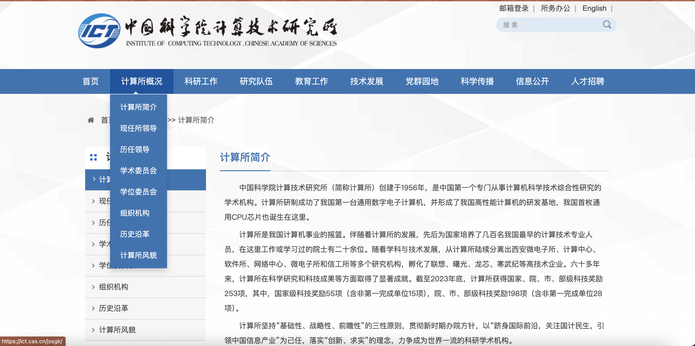
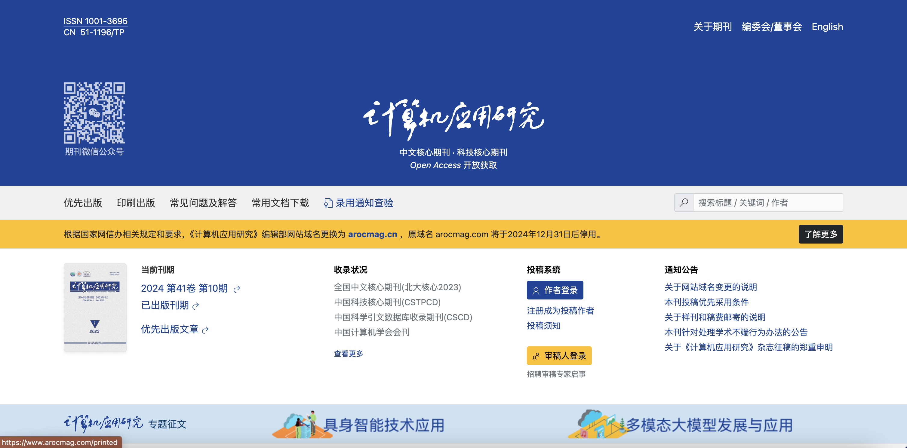
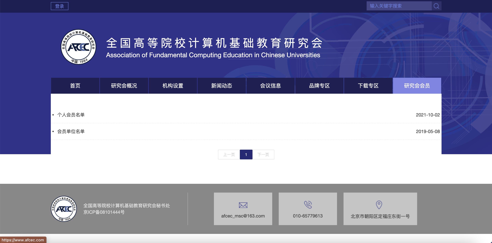
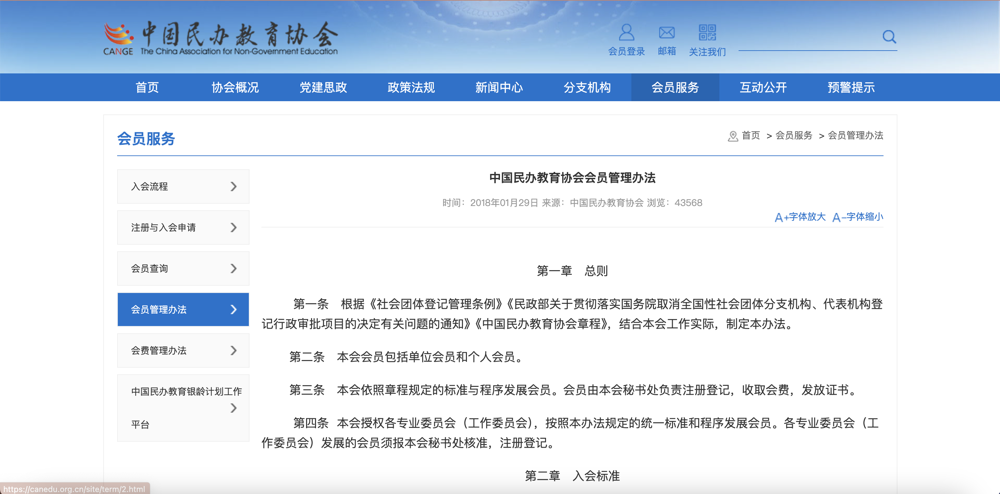

# 会员证书

会员证书是其他会员单位颁布给会员的凭证，这是其他单位的会员证书信息

# 庆阳青云计算机研究院-网站的类型

## 第一种类型

地址: https://ict.cas.cn/jssgk/jssjj/
## 第二种类型

地址: https://www.arocmag.com/
## 第三种类型

地址: https://www.afcec.com/Home/Members/131
## 第四种类型

地址: https://canedu.org.cn/site/term/28.html

# 庆阳青云计算机研究院-网站的内容

- 首页
  - 简介：简要介绍研究院的历史背景、愿景与使命。
  - 最新动态：展示最新的新闻、活动公告或研究成果。
  - 特色服务/项目：突出研究院的核心竞争力和服务领域。
- 关于我们
  - 机构简介：详细介绍研究院的成立背景、组织架构和发展历程。
  - 合作伙伴：列出重要的合作单位或企业。
- 研究方向
  - 研究领域：列举研究院关注的研究方向和技术领域。
- 资源中心
  - 学术论文：提供研究院成员发表的学术文章下载链接。
  - 技术报告：发布技术评估、市场分析等报告。
- 章程草案
- 加入我们
- 联系我们
- 党建思政
  - 工作动态
  - 学习园地
  - 经验特色
- 会员管理
  - 入会流程
  - 入会申请（入会申请表包含企业申请表和高校申请表）
  - 会员名单
  - 会员管理办法
  - 会费管理办法

